# Windows-Server-Group-Policy-GPO-practice-tasks
1. Software deployment (MSI) 2. Folder redirection 3. USB disable 4. Desktop wallpaper & Screen saver configuration 5. Shortcut creation 
## Tools and technologies used
- Windows Server 2019
- Active Directory domain services
- Group Policy Management
## 🟠 Task 1 – Software Deployment (MSI Installation)
Purpose: Automatically deploy 7-Zip.msi software to all or specified users.
➡️ Path: Computer Configuration → Software Installation
✅ Result: 7-Zip is installed automatically when users log in.

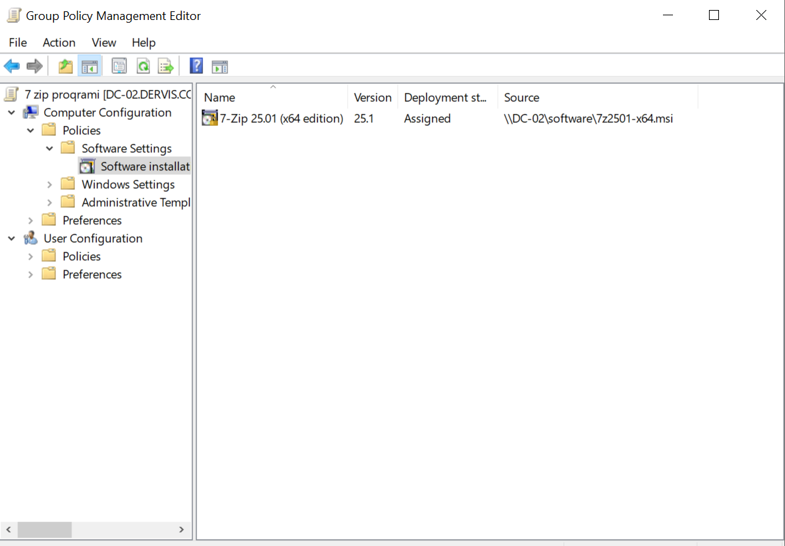
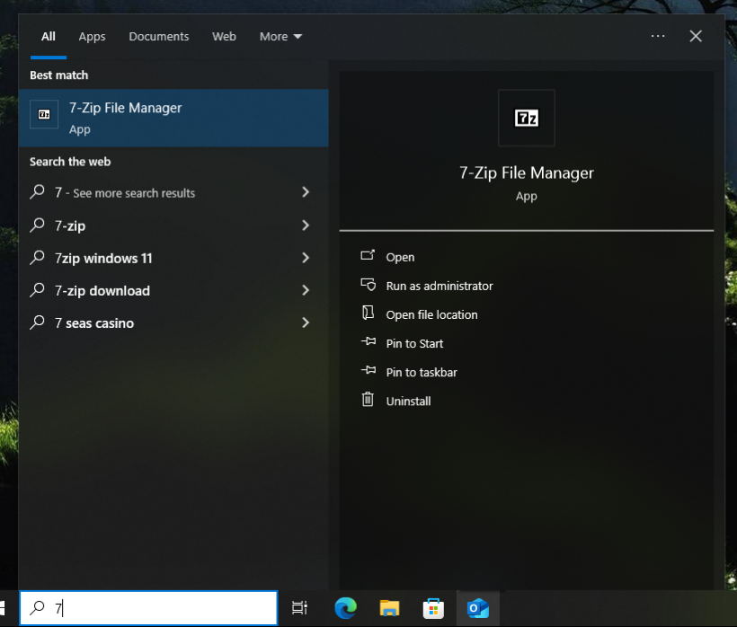


## 🟠 Task 2 – Folder Redirection (Documents)
Purpose: Redirect users’ Documents folder to the shared location \\DC01\UserDocs.
➡️ Path: User Configuration → Folder Redirection
✅ Result: Files created in the Documents folder on the client PC are stored on the server.

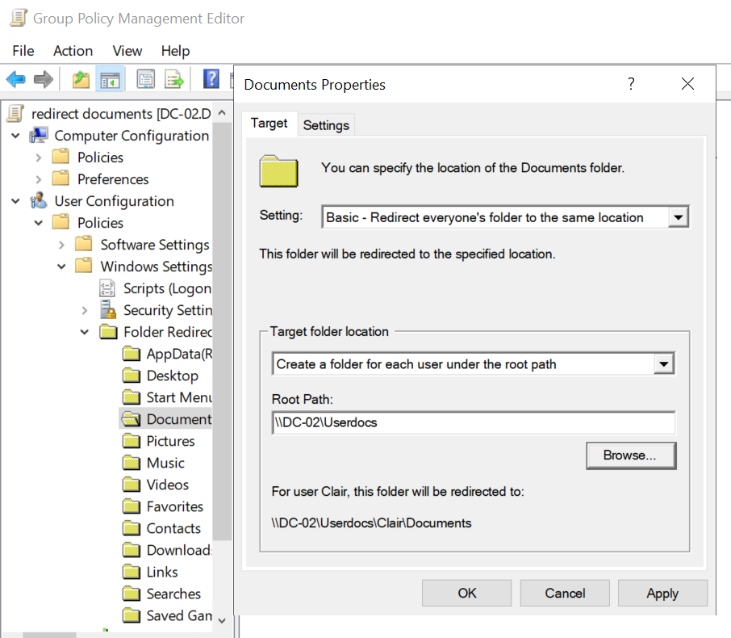
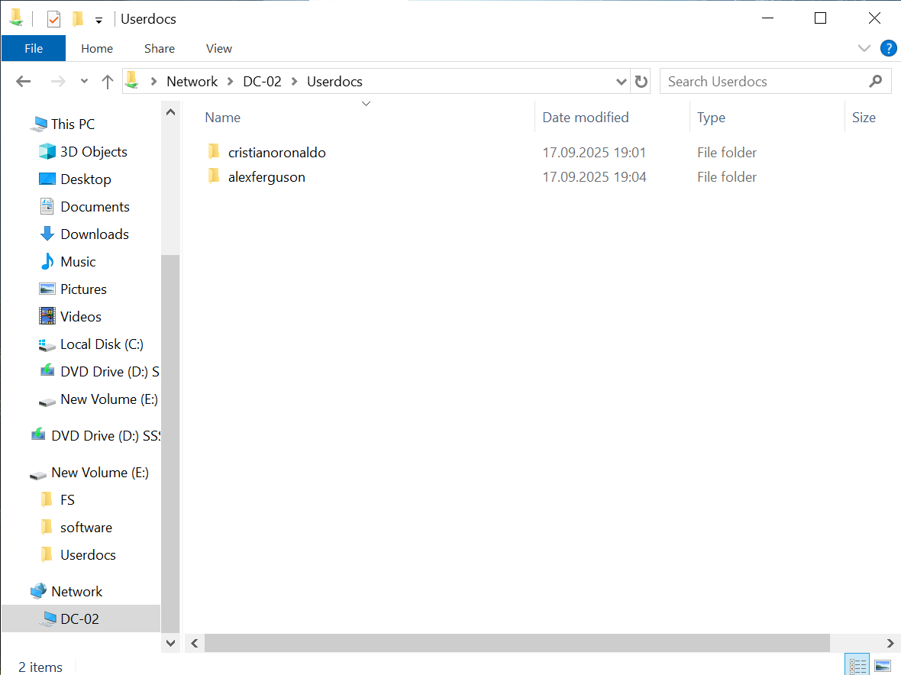
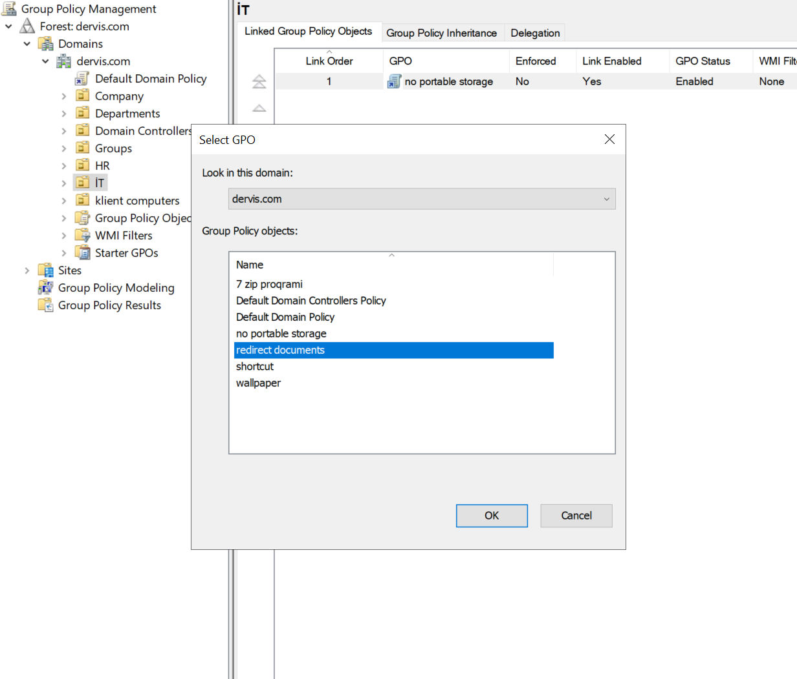


---

## 🟡 Task 3 – Disable USB
Purpose: Block USB storage devices for computers in a specific OU.
➡️ Path: Computer Configuration → Administrative Templates → System → Removable Storage Access
✅ Result: When a user plugs in a USB flash drive, the system will not recognize it.

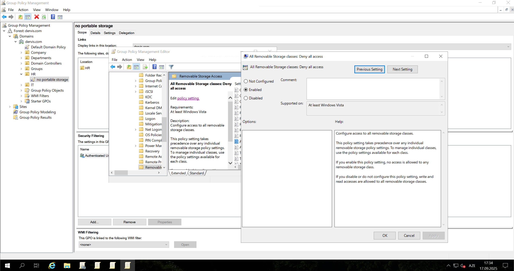

---

## 🔴 Task 4 – Enforce Wallpaper and Screen Saver
Purpose:
- Apply a default wallpaper for all users.
- After 10 minutes of inactivity, the screen saver activates and requires a password on resume.
➡️ Path: User Configuration → Administrative Templates → Desktop & Control Panel
✅ Result: After 10 minutes the screen locks, and the user must enter a password to return.
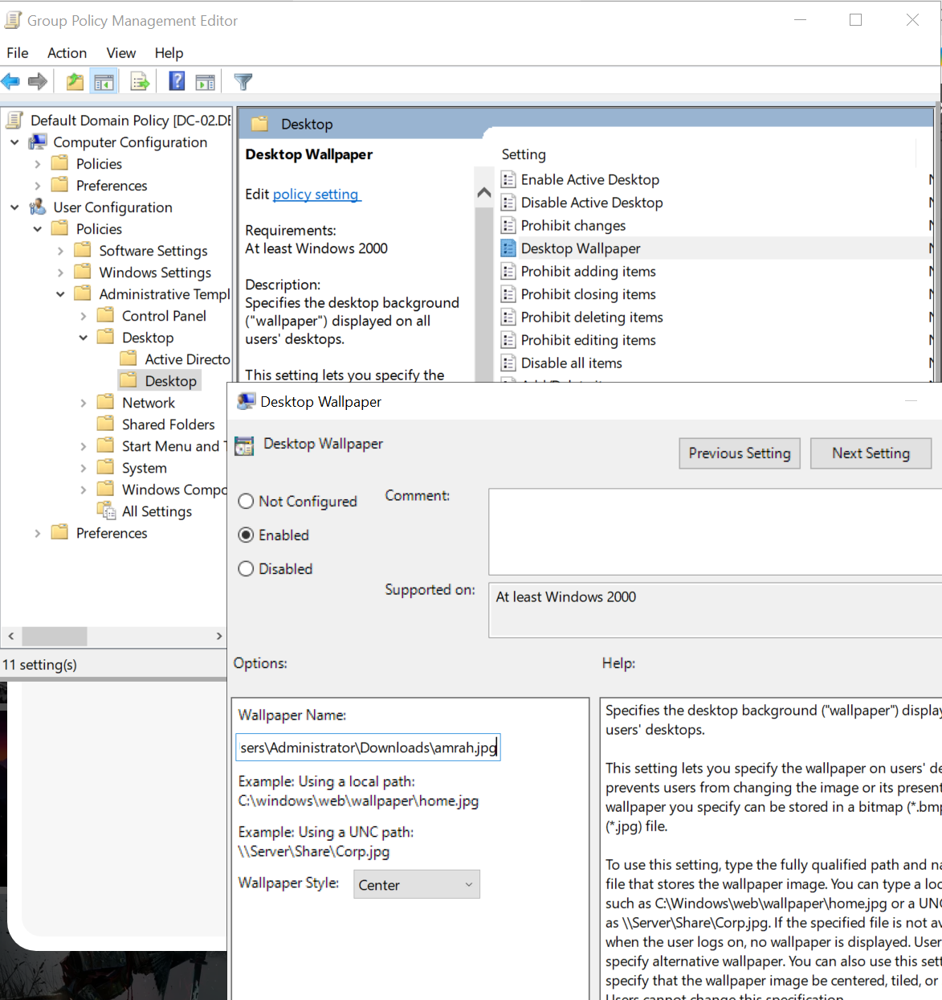

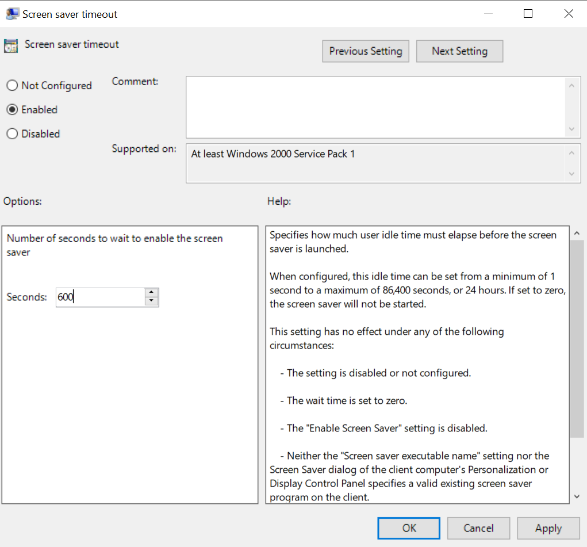
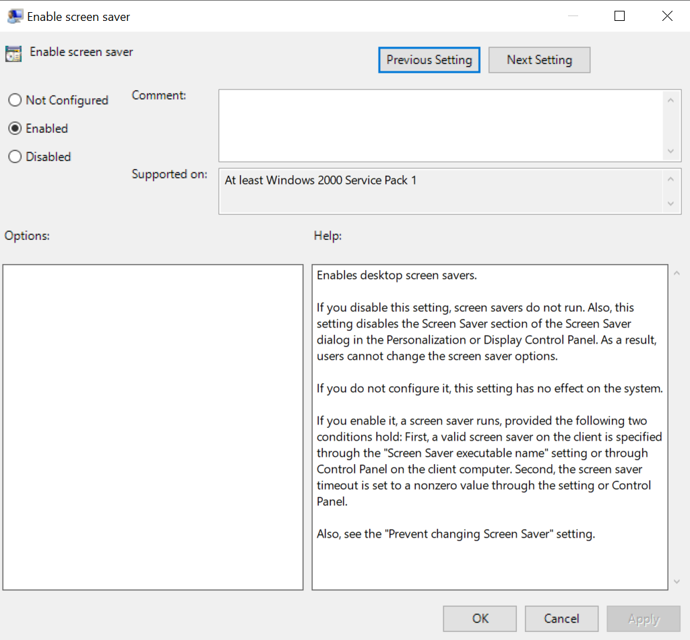
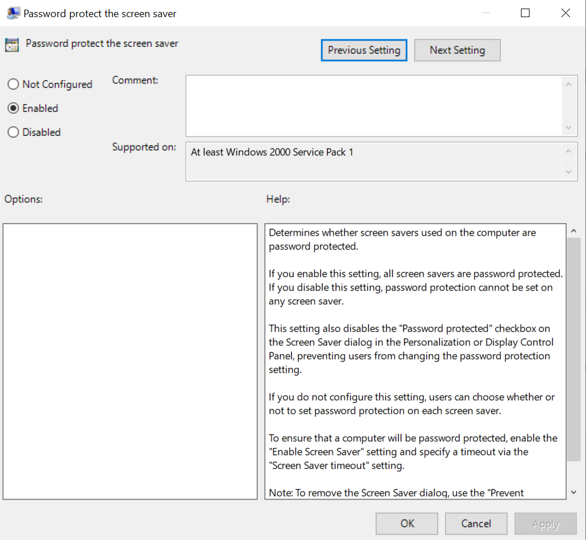


---

## 🟠 Task 5 – Desktop Shortcut Creation
Purpose: Add a shortcut to a shared file on all domain users’ desktops.
➡️ Path: User Configuration → Preferences → Windows Settings → Shortcuts
✅ Result: A shortcut appears on the user’s desktop and opens the shared file when clicked.
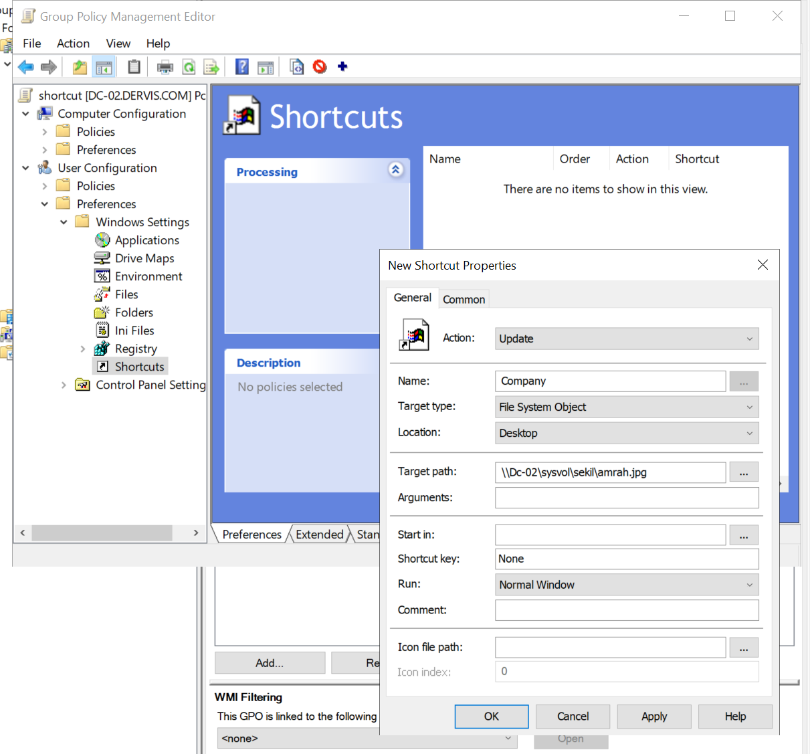
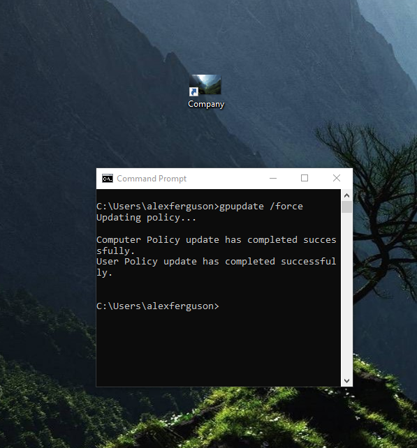


## 🔧 Forcing & Testing Group Policies
Use the commands below on a client machine to force GPO updates and verify application.

```cmd
:: Force all Group Policy settings to update immediately
gpupdate /force

:: View summary of applied Group Policy Objects
gpresult /r

:: Generate a detailed HTML report of applied GPOs
gpresult /h C:\gporeport.html

:: Open Resultant Set of Policy (GUI)
rsop.msc


